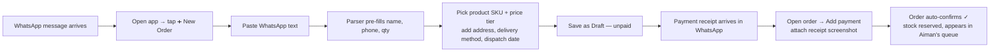
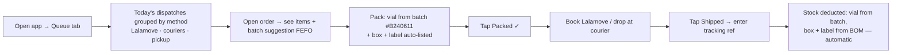
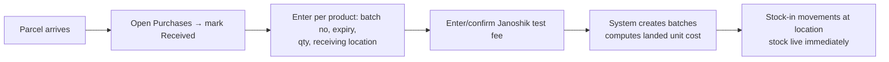

# 05 — User Journeys

How the two roles move through the app day-to-day. Each journey shows the trigger, the steps, and what the system does behind the scenes. Screen names refer to [`06-ui-ux.md`](06-ui-ux.md).

**Personas:**

- 🧑‍💼 **Nadeem (Admin)** — runs the business from his phone/laptop. Enters orders from WhatsApp, buys stock, watches margins and cash.
- 📦 **Aiman (Ops)** *(stand-in name)* — the fulfiller. Works from his phone. Packs, ships, updates stock. Never sees costs, margins, or cash.

---

## Journey 1 — Order comes in from WhatsApp (Admin) ⭐ most frequent

**Trigger:** the seller (or a direct customer) sends an order in WhatsApp.

1. Nadeem copies the message (`NAMA : … / PHONE NO : … / QUANTITY : …`), opens **New Order**, taps **Paste from WhatsApp**. The parser fills customer name, phone, quantity; leftover text lands in notes.
2. He picks the product ("Retatrutide 60mg"), the price tier auto-selects from the channel (seller → seller price), and fills address + delivery method + target dispatch date. **Under 60 seconds total.**
3. Saved as **Draft (unpaid)**. When the payment proof arrives, he opens the order, taps **Add payment**, attaches the screenshot → status flips to **Confirmed**, stock is reserved, and the order appears in the ops prep queue. A cash inflow is logged automatically.

**What this kills:** re-typing order details into chat threads, "did she pay already?" scrolling, forgetting which orders are confirmed.

---

## Journey 2 — Fulfilment day (Ops)

**Trigger:** Aiman starts his day / a Lalamove run is booked for today.

1. The **Queue** shows exactly what must go out today (and what's coming tomorrow), grouped by delivery method. Short-stock orders are flagged red before he starts.
2. Each order card says which batch to pick (earliest expiry first) and lists the packaging components. He packs, taps **Packed**, ships, taps **Shipped**, pastes the tracking ref.
3. Stock — vial, box, label — deducts automatically from *his* location. Nadeem sees status change in real time. Nobody messages anybody.

**What this kills:** "dah pos ke belum?" check-in messages; picking the wrong (newer) batch while an older one expires.

---

## Journey 3 — "How much stock do we have?" (Both roles)

**Trigger:** seller asks about availability / Nadeem plans a promo / Aiman is unsure.

1. Open **Stock** tab → search or scroll the SKU list.
2. Each SKU shows: **total available** (on-hand − reserved), split per location (Nadeem's / Aiman's), nearest expiry, and a low-stock/expiry badge.
3. Tap a SKU → batch list + full movement history (who did what, when).

*Answer time: ~5 seconds, no messages sent.* This is the single most valuable screen in v1.

---

## Journey 4 — Stock arrives from supplier (Admin, sometimes Ops)

**Trigger:** a purchase placed earlier arrives at one of the houses.

Also covers: **transfer between houses** (Stock → SKU → Transfer: qty + from/to location — two movements, one action) and **adjustments** (count correction, damaged vial, expired write-off — always with a reason).

---

## Journey 5 — Restock decision (Admin)

**Trigger:** weekly glance, or a low-stock flag on the dashboard.

1. **Dashboard** shows SKUs under their reorder point and batches nearing expiry.
2. Nadeem opens **Purchases → New**, picks supplier (lead time shown), adds SKUs + quantities + agreed unit cost.
3. Status `ordered` → order shows as **incoming stock** ("50 vials, ~Aug 20") so he can accept seller orders against it.
4. When he pays the supplier, he marks it **paid** → cash outflow logged with the actual date.

---

## Journey 6 — Month-end money check (Admin only)

**Trigger:** end of month / "can I afford the next batch?"

1. **Cash** tab: current bank position (derived: opening + inflows − outflows).
2. Monthly view: inflows by source, outflows by category (stock, testing, delivery, salary, packaging, fees…), closing balance.
3. Recurring salary entry pops up on payday for one-tap confirm.
4. **Margins** view answers: which product earns most? seller channel vs direct — is the QR-on-box push working?

---

## Journey 7 — Repeat customer via QR box (Admin)

**Trigger:** end-customer scans the QR on their box → lands on indexalab.shop → WhatsApps Nadeem directly.

1. Same intake as Journey 1, but channel = **Direct** (public price auto-selected).
2. On phone-number match the app shows "**Returning customer** — 3rd order, last one 2026-06-12" — proof the direct-sales strategy is working, measurable in the channel margin view (F3).

---

## Journey map summary

| Journey | Role | Frequency | Screens touched | Success metric |
|---------|------|-----------|-----------------|----------------|
| 1. WhatsApp order intake | Admin | ~daily | New Order | < 60s per order |
| 2. Fulfilment day | Ops | ~daily | Queue, Order detail | zero status-check messages |
| 3. Stock check | Both | many/day | Stock | answer in < 5s |
| 4. Receiving/transfer | Both | ~weekly | Purchases, Stock | batch + cost captured at door |
| 5. Restock decision | Admin | weekly | Dashboard, Purchases | no surprise stockouts |
| 6. Cash & margin review | Admin | monthly+ | Cash, Margins | trustworthy numbers, zero spreadsheets |
| 7. QR repeat customer | Admin | growing | New Order | direct-channel share ↑ |
